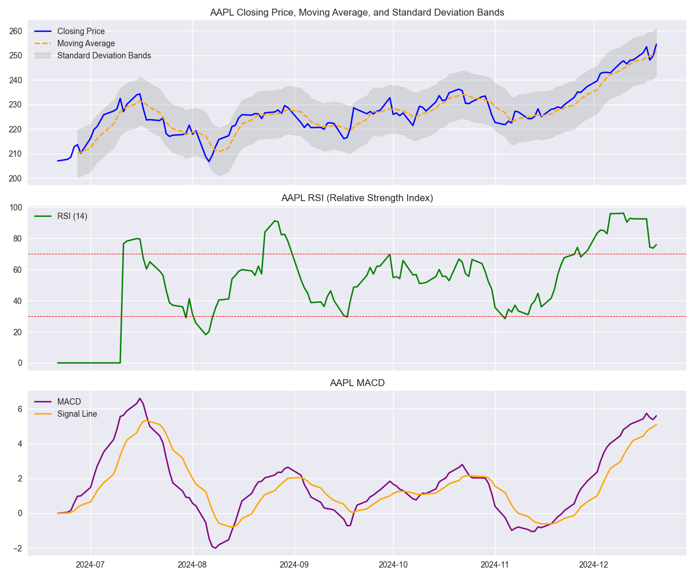

# StockAnalyzer

Этот проект предоставляет инструмент для анализа и визуализации данных об акциях. Он загружает исторические данные с помощью библиотеки `yfinance`, вычисляет скользящие средние, Relative Strength Index (RSI), Moving Average Convergence Divergence (MACD), стандартное отклонение, уведомляет о сильных колебаниях цен, создаёт графики с возможностью выбора стиля и экспортирует данные в формат CSV. Пользователи могут вводить тикеры акций, периоды анализа и выбирать стиль отображения графиков.

---

---

## Основные функции

- **Загрузка исторических данных** с использованием `yfinance`.
- **Вычисление скользящих средних** для анализа трендов.
- **Вычисление стандартного отклонения** цены закрытия для оценки волатильности.
- **Вычисление Relative Strength Index (RSI)** для оценки зон перекупленности/перепроданности.
- **Вычисление Moving Average Convergence Divergence (MACD)** для анализа трендов и моментов разворота.
- **Уведомления о сильных колебаниях цен**, если изменения превышают указанный порог.
- **Построение и сохранение графиков** с возможностью выбора стиля:
  - График включает цены закрытия, скользящие средние, RSI и MACD и полосы стандартного отклонения.
  - Поддерживаемые стили: `ggplot`, `seaborn-v0_8`, `dark_background`, `classic` и другие.
- **Построение и сохранение графиков** с ценами закрытия, скользящими средними, RSI и MACD с помощью функции `create_and_save_plot_with_indicators`.
- **Экспорт данных в CSV** для сохранения и дальнейшего анализа.
- **Обработка некорректных данных**:
  - Неверные тикеры акций.
  - Неподдерживаемые периоды времени.
- Полное **тестирование с использованием `pytest`**.

---

## Установка

### Требования

- Python 3.9 или новее.
- Виртуальная среда (рекомендуется).

### Шаги

1. Склонируйте репозиторий:

   ```bash
   git clone https://github.com/savinleonid/StockAnalyzer.git
   cd StockAnalyzer
   ```

2. Создайте и активируйте виртуальную среду:

   ```bash
   python -m venv .venv
   source .venv/bin/activate  # На Windows: .venv\Scripts\activate
   ```

3. Установите зависимости:

   ```bash
   pip install -r requirements.txt
   ```

---

## Использование

1. Запустите главный скрипт:

   ```bash
   python main.py
   ```

2. Следуйте инструкциям:

   - Введите тикер акции (например, `AAPL` для Apple Inc.).
   - Введите период времени (например, `1mo` для одного месяца) или укажите конкретные даты начала и окончания анализа.
   - Выберите стиль графика (например, ggplot, seaborn-v0_8, default).

3. Получите результаты:

- Средняя цена закрытия и скользящее среднее.
- Стандартное отклонение отображается в консоли для оценки волатильности.
- Данные экспортируются в CSV-файл с именем `<Тикер>_custom_data.csv`.
- Уведомления о сильных колебаниях.
- График сохраняется как PNG-файл. Он включает:
  - Цены закрытия.
  - Скользящие средние.
  - Полосы стандартного отклонения.
  - RSI.
  - MACD и сигнальную линию.

---

## Тестирование

Для запуска тестов выполните:

```bash
pytest tests/
```

---

## Структура проекта

```
StockAnalyzer/
├── data_download.py          # Модуль для загрузки, обработки данных и расчёта индикаторов
├── data_plotting.py          # Модуль для построения графиков с индикаторами
├── main.py                   # Главный скрипт для взаимодействия с пользователем
├── tests/                    # Папка с тестами
│   ├── test_calculate_average_price.py
│   ├── test_task2.py
│   ├── test_export_data.py
│   ├── test_fetch_stock_data.py  # Тесты для загрузки данных
│   ├── test_indicators.py        # Тесты для стандартного отклонения, RSI и MACD
│   ├── test_indicators.py    # Тесты для RSI и MACD
│   ├── test_plot_styles.py       # Тесты для выбора стилей графиков
│   ├── test_main_error_handling.py
│   └── __init__.py
├── requirements.txt          # Список зависимостей
└── README.md                 # Документация проекта
```

---

## Участие

Будем рады вашим улучшениям! Пожалуйста, создайте issue или pull request с предложенными изменениями.

